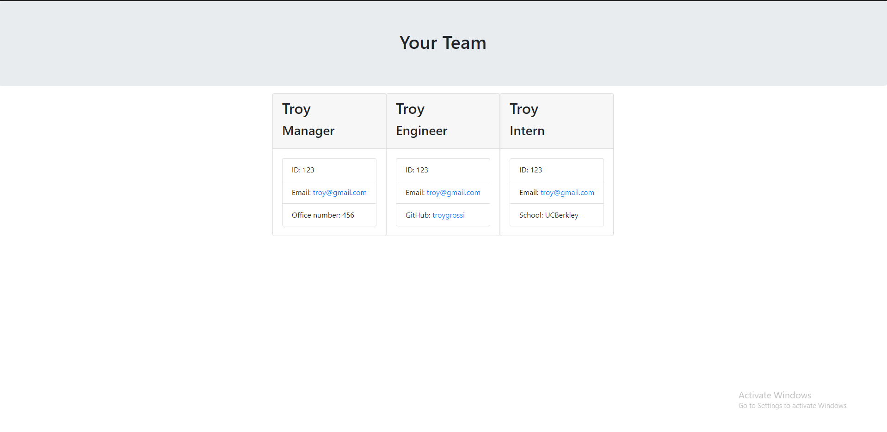

# Team Profile Generator

## Developed By: Troy Grossi
### Walkthrough:
https://watch.screencastify.com/v/me97gueaedUVdmgLqyfr

 
 

# Description

- The purpose of this project was to create a node application that renders a generic work team's credentials into HTML. 

# Table of Contents

- [Installation](#installation)

- [Usage](#usage)

- [Contribution](#contribution)

- [License](#license)

<!---->

- [Questions](#questions)

# Installation

Download the project from github. Must have node and npm downloaded on your client. Type "npm install" in the terminal from the root of this project to download the dependencies. From here everything will be up and running.

- Dependencies: jest, inquirer

# Usage

- From the root of the directory type "npm start" to start the server
- An inquirer prompt will begin to list off a series of questions
- The prompts will first have you fill out the manager object
- You will then be prompted to choose an intern or engineer team member
- You can either choose to add a team member or end the prompts
- If you choose to add a team member you will be prompted to add more team members until you select "I don't want to add any more team members"
- When the prompts end an html file will named "team.html" be rendered in the "output" directory
- Right click the file and click view in default browser to view the rendered html in the browser

# Contribution

Refer to:
[Contribution Convenant](https://www.contributor-covenant.org/version/2/0/code_of_conduct/code_of_conduct.md)

# License

MIT

# Questions

Ask questions at my github

- GitHub Link: https://github.com/troygrossi